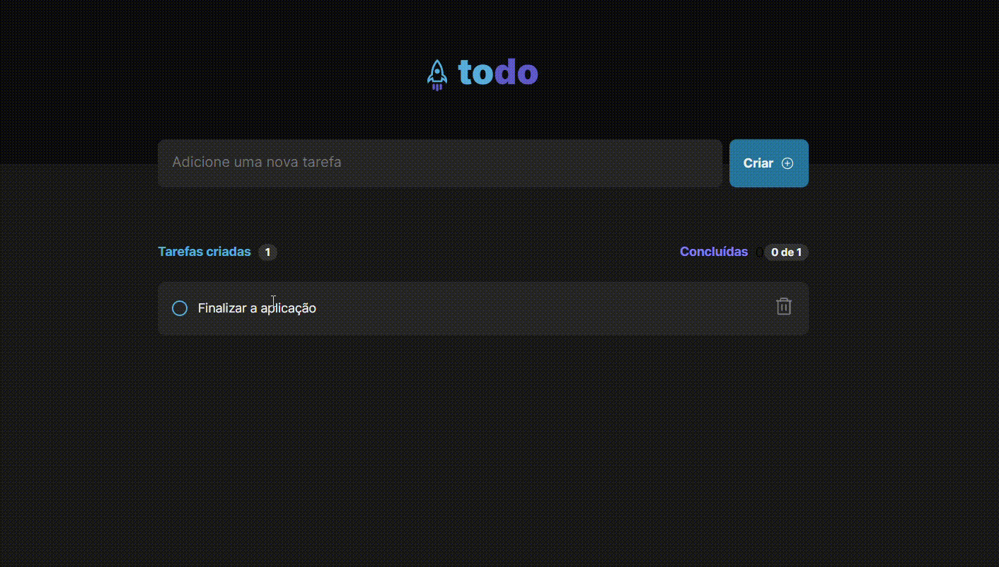

# To Do List

<strong>To Do List</strong> É uma aplicação desenvolvida em ReactJS para web e react Native para Mobile, que simula uma lista de atividades. Trata-se de um projeto Front End onde o objetivo é treinar as habilidades de comunicação de componentes e estilização da página. 

## ReactJS

    

## React Native

    

<h2 > <strong>Funções da aplicação:</strong> </h2>
As funções apresentadas são todas contruídas em cima das tecnologias do front end, sendo elas:

<ul>
    <li>Criar tarefas</li>
    <li>Apagar taferas</li>
    <li>Concluir tarefas</li>
    <li>Contagem de tarefas totais e realizadas</li>
</ul> 

